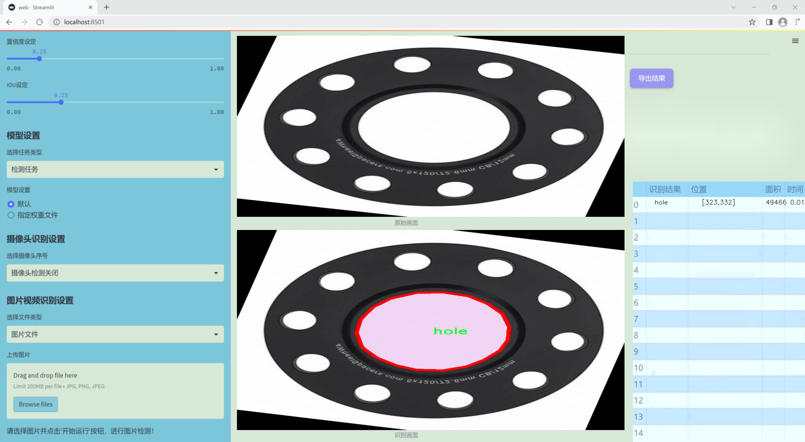
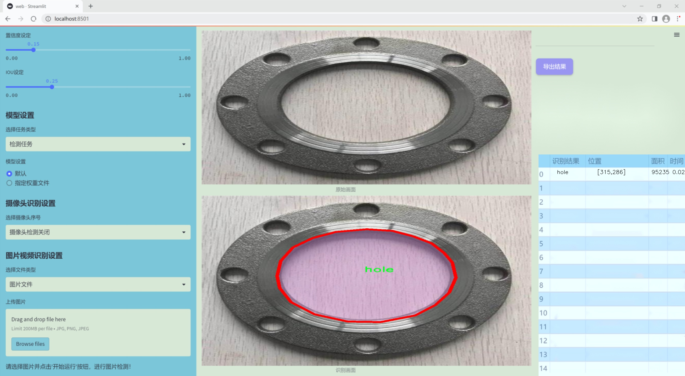
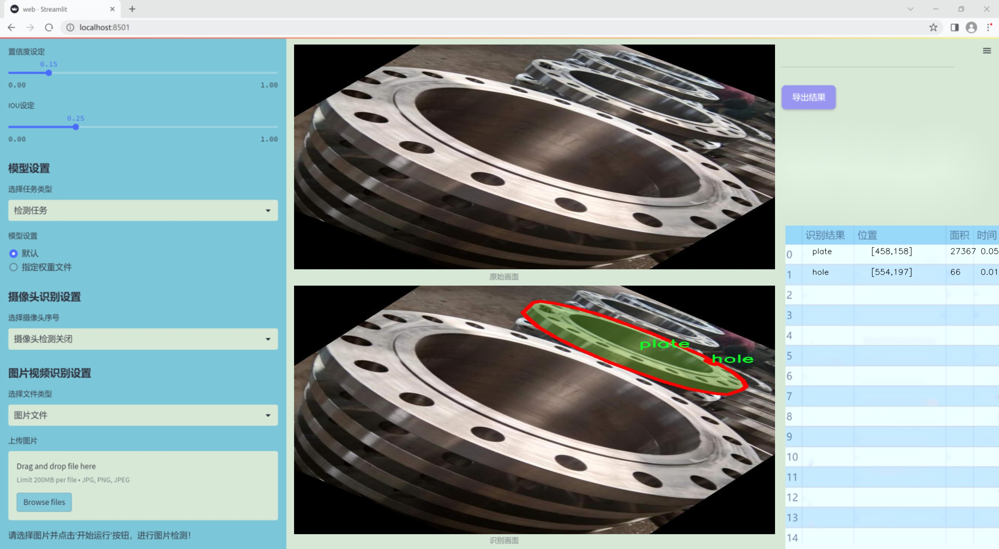
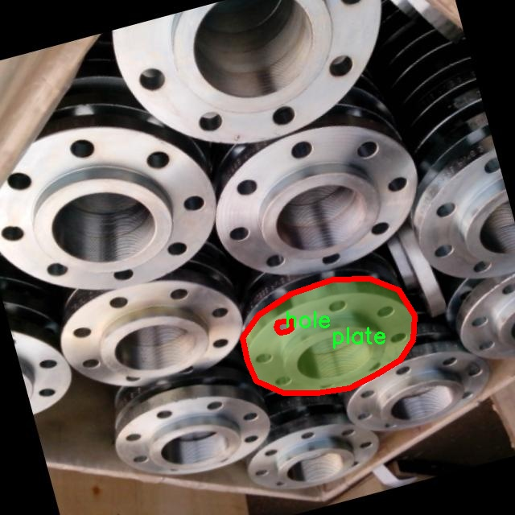
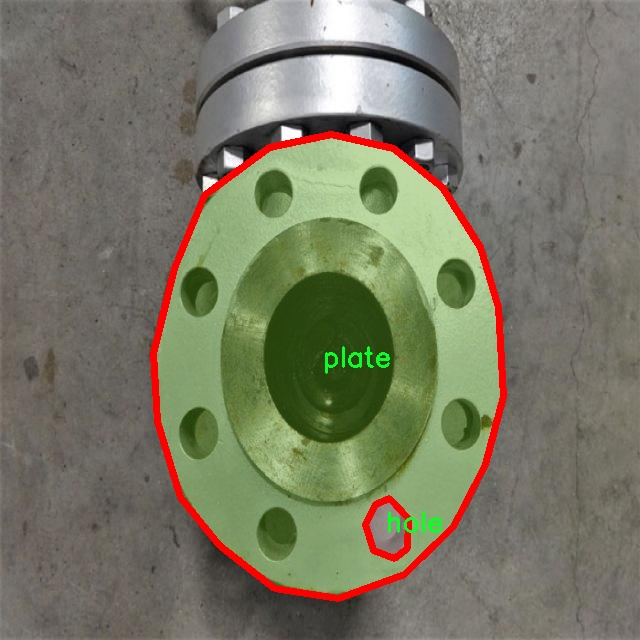
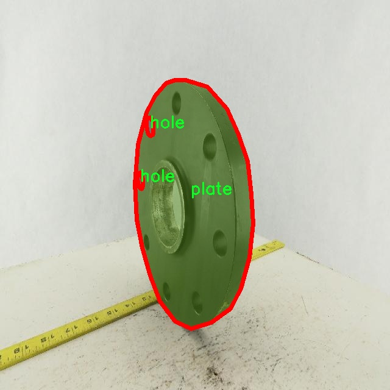
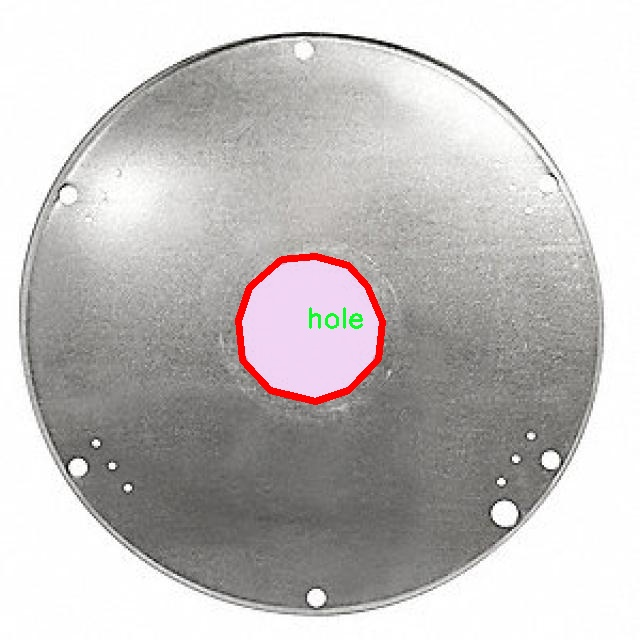
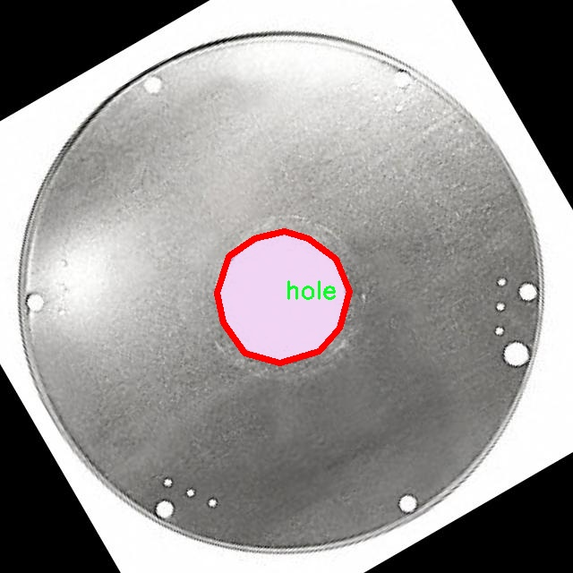

### 1.背景意义

研究背景与意义

随着工业自动化和智能制造的快速发展，精确的尺寸测量和定位技术在各类制造业中变得愈发重要。法兰作为连接管道和设备的重要部件，其尺寸的准确测量直接影响到设备的安装质量和运行效率。因此，开发一种高效、准确的法兰尺寸测量定位系统具有重要的实际意义。传统的法兰尺寸测量方法往往依赖人工操作，不仅效率低下，而且容易受到人为因素的影响，导致测量结果的不准确。为了解决这一问题，基于计算机视觉的自动化测量技术逐渐成为研究的热点。

在众多计算机视觉算法中，YOLO（You Only Look Once）系列算法因其高效的实时目标检测能力而受到广泛关注。YOLOv11作为该系列的最新版本，进一步提升了检测精度和速度，适用于复杂环境下的目标识别任务。本研究旨在基于改进的YOLOv11算法，构建一个专门针对法兰尺寸测量的图像分割系统。该系统将能够自动识别和分割法兰的关键部件，如孔和板，为后续的尺寸测量提供可靠的数据支持。

本研究所使用的数据集包含410幅经过精心标注的法兰图像，涵盖了两类主要对象：孔和板。通过对图像进行多种预处理和增强操作，确保了数据集的多样性和代表性。这为训练和优化YOLOv11模型提供了坚实的基础。通过对法兰尺寸的自动化测量，不仅可以提高生产效率，还能降低人为错误，提高产品质量。综上所述，本研究不仅具有重要的理论价值，也为实际生产中的法兰尺寸测量提供了新的解决方案，推动了智能制造技术的发展。

### 2.视频效果

[2.1 视频效果](https://www.bilibili.com/video/BV1U3SPYREuA/)

### 3.图片效果







##### [项目涉及的源码数据来源链接](https://kdocs.cn/l/cszuIiCKVNis)**

注意：本项目提供训练的数据集和训练教程,由于版本持续更新,暂不提供权重文件（best.pt）,请按照6.训练教程进行训练后实现上图演示的效果。

### 4.数据集信息

##### 4.1 本项目数据集类别数＆类别名

nc: 2
names: ['hole', 'plate']


该项目为【图像分割】数据集，请在【训练教程和Web端加载模型教程（第三步）】这一步的时候按照【图像分割】部分的教程来训练

##### 4.2 本项目数据集信息介绍

本项目数据集信息介绍

本项目的数据集专注于法兰（Flange）尺寸测量与定位的图像分割任务，旨在通过改进YOLOv11模型，提升法兰相关部件的检测与识别精度。数据集中包含了两类主要对象，分别为“孔”（hole）和“板”（plate），这两类对象在法兰的结构与功能中扮演着至关重要的角色。孔通常用于连接和固定，而板则是法兰的主要承载部分，二者的准确识别与测量对于工程应用至关重要。

为了确保模型的有效性与泛化能力，数据集经过精心构建，涵盖了多种不同形状、尺寸和材料的法兰图像。这些图像不仅来自于标准的工业法兰，还包括了在实际应用中可能遇到的各种变体，确保模型能够适应多样化的场景。数据集中包含的图像经过标注，确保每个“孔”和“板”对象的边界清晰可见，为后续的图像分割任务提供了高质量的训练数据。

此外，数据集还考虑到了不同光照条件、背景复杂度和拍摄角度等因素，以模拟真实环境中的各种挑战。这种多样性不仅增强了模型的鲁棒性，也为其在实际应用中的推广奠定了基础。通过使用该数据集进行训练，改进后的YOLOv11模型将能够在法兰尺寸测量与定位任务中实现更高的准确性和效率，为工业自动化和智能制造提供有力支持。总之，本项目的数据集为法兰相关的图像分割任务提供了坚实的基础，助力于推动相关技术的发展与应用。











### 5.全套项目环境部署视频教程（零基础手把手教学）

[5.1 所需软件PyCharm和Anaconda安装教程（第一步）](https://www.bilibili.com/video/BV1BoC1YCEKi/?spm_id_from=333.999.0.0&vd_source=bc9aec86d164b67a7004b996143742dc)


[5.2 安装Python虚拟环境创建和依赖库安装视频教程（第二步）](https://www.bilibili.com/video/BV1ZoC1YCEBw?spm_id_from=333.788.videopod.sections&vd_source=bc9aec86d164b67a7004b996143742dc)

### 6.改进YOLOv11训练教程和Web_UI前端加载模型教程（零基础手把手教学）

[6.1 改进YOLOv11训练教程和Web_UI前端加载模型教程（第三步）](https://www.bilibili.com/video/BV1BoC1YCEhR?spm_id_from=333.788.videopod.sections&vd_source=bc9aec86d164b67a7004b996143742dc)


按照上面的训练视频教程链接加载项目提供的数据集，运行train.py即可开始训练



     Epoch   gpu_mem       box       obj       cls    labels  img_size
     1/200     20.8G   0.01576   0.01955  0.007536        22      1280: 100%|██████████| 849/849 [14:42<00:00,  1.04s/it]
               Class     Images     Labels          P          R     mAP@.5 mAP@.5:.95: 100%|██████████| 213/213 [01:14<00:00,  2.87it/s]
                 all       3395      17314      0.994      0.957      0.0957      0.0843

     Epoch   gpu_mem       box       obj       cls    labels  img_size
     2/200     20.8G   0.01578   0.01923  0.007006        22      1280: 100%|██████████| 849/849 [14:44<00:00,  1.04s/it]
               Class     Images     Labels          P          R     mAP@.5 mAP@.5:.95: 100%|██████████| 213/213 [01:12<00:00,  2.95it/s]
                 all       3395      17314      0.996      0.956      0.0957      0.0845

     Epoch   gpu_mem       box       obj       cls    labels  img_size
     3/200     20.8G   0.01561    0.0191  0.006895        27      1280: 100%|██████████| 849/849 [10:56<00:00,  1.29it/s]
               Class     Images     Labels          P          R     mAP@.5 mAP@.5:.95: 100%|███████   | 187/213 [00:52<00:00,  4.04it/s]
                 all       3395      17314      0.996      0.957      0.0957      0.0845


###### [项目数据集下载链接](https://kdocs.cn/l/cszuIiCKVNis)

### 7.原始YOLOv11算法讲解

YOLOv11是一种由Ultralytics公司开发的最新一代目标检测模型，以其增强的特征提取能力和更高的效率在计算机视觉领域引人注目。该模型在架构上进行了关键升级，通过更新主干和颈部结构，显著提高了对复杂视觉场景的理解和处理精度。YOLOv11不仅在目标检测上表现出色，还支持实例分割、图像分类、姿态估计和定向目标检测（OBB）等任务，展示出其多功能性。

与其前身YOLOv8相比，YOLOv11在设计上实现了深度和宽度的改变，同时引入了几个创新机制。其中，C3k2机制是对YOLOv8中的C2f的改进，提升了浅层特征的处理能力；C2PSA机制则进一步优化了特征图的处理流程。解耦头的创新设计，通过增加两个深度卷积（DWConv），提高了模型对细节的感知能力和分类准确性。

在性能上，YOLOv11m模型在COCO数据集上的平均精度（mAP）提高，并减少了22%的参数量，确保了在运算效率上的突破。该模型可以部署在多种平台上，包括边缘设备、云平台以及支持NVIDIA GPU的系统，彰显出卓越的灵活性和适应性。总体而言，YOLOv11通过一系列的创新突破，对目标检测领域产生了深远的影响，并为未来的开发提供了新的研究方向。


****文档**** ： _ _https://docs.ultralytics.com/models/yolo11/__

****代码链接**** ： _ _https://github.com/ultralytics/ultralytics__

******Performance Metrics******


​ ** **关键特性****

****◆**** ** **增强的特征提取能力**** ：YOLO11采用了改进的主干和颈部架构，增强了 ** **特征提取****
能力，能够实现更精确的目标检测和复杂任务的执行。

****◆**** ** **优化的效率和速度****
：YOLO11引入了精细化的架构设计和优化的训练流程，提供更快的处理速度，并在准确性和性能之间保持最佳平衡。

****◆**** ** **参数更少、精度更高****
：通过模型设计的改进，YOLO11m在COCO数据集上实现了更高的平均精度（mAP），同时使用的参数比YOLOv8m少22%，使其在计算上更加高效，而不牺牲准确性。

****◆**** ** **跨环境的适应性**** ：YOLO11可以无缝部署在各种环境中，包括边缘设备、云平台和支持NVIDIA
GPU的系统，确保最大的灵活性。

****◆**** ** **支持广泛任务****
：无论是目标检测、实例分割、图像分类、姿态估计还是定向目标检测（OBB），YOLO11都旨在应对一系列计算机视觉挑战。

****支持的任务和模式****


​YOLO11建立在YOLOv8中引入的多功能模型范围之上，为各种计算机视觉任务提供增强的支持:


​该表提供了YOLO11模型变体的概述，展示了它们在特定任务中的适用性以及与Inference、Validation、Training和Export等操作模式的兼容性。从实时检测到复杂的分割任务
，这种灵活性使YOLO11适用于计算机视觉的广泛应用。

##### yolov11的创新

■ yolov8 VS yolov11

YOLOv5，YOLOv8和YOLOv11均是ultralytics公司的作品，ultralytics出品必属精品。


​ **具体创新点** ：

**① 深度（depth）和宽度 （width）**

YOLOv8和YOLOv11是基本上完全不同。

**② C3k2机制**

C3k2有参数为c3k，其中在网络的浅层c3k设置为False。C3k2就相当于YOLOv8中的C2f。


​ **③ C2PSA机制**

下图为C2PSA机制的原理图。


​ **④ 解耦头**

解耦头中的分类检测头增加了两个 **DWConv** 。


▲Conv

    
    
    def autopad(k, p=None, d=1):  # kernel, padding, dilation
    
        """Pad to 'same' shape outputs."""
    
        if d > 1:
    
            k = d * (k - 1) + 1 if isinstance(k, int) else [d * (x - 1) + 1 for x in k]  # actual kernel-size
    
        if p is None:
    
            p = k // 2 if isinstance(k, int) else [x // 2 for x in k]  # auto-pad
    
    return p
    
    
    class Conv(nn.Module):
    
        """Standard convolution with args(ch_in, ch_out, kernel, stride, padding, groups, dilation, activation)."""
    
    
        default_act = nn.SiLU()  # default activation
    
    
        def __init__(self, c1, c2, k=1, s=1, p=None, g=1, d=1, act=True):
    
            """Initialize Conv layer with given arguments including activation."""
    
            super().__init__()
    
            self.conv = nn.Conv2d(c1, c2, k, s, autopad(k, p, d), groups=g, dilation=d, bias=False)
    
            self.bn = nn.BatchNorm2d(c2)
    
            self.act = self.default_act if act is True else act if isinstance(act, nn.Module) else nn.Identity()
    
    
        def forward(self, x):
    
            """Apply convolution, batch normalization and activation to input tensor."""
    
            return self.act(self.bn(self.conv(x)))
    
    
        def forward_fuse(self, x):
    
            """Perform transposed convolution of 2D data."""
    
            return self.act(self.conv(x))

▲Conv2d

    
    
    torch.nn.Conv2d(in_channels, out_channels, kernel_size, stride=1, padding=0, dilation=1, groups=1, bias=True, padding_mode='zeros')

▲DWConv

DWConv ** **代表 Depthwise Convolution（深度卷积）****
，是一种在卷积神经网络中常用的高效卷积操作。它主要用于减少计算复杂度和参数量。

    
    
    class DWConv(Conv):
    
        """Depth-wise convolution."""
    
    
        def __init__(self, c1, c2, k=1, s=1, d=1, act=True):  # ch_in, ch_out, kernel, stride, dilation, activation
    
            """Initialize Depth-wise convolution with given parameters."""
    
            super().__init__(c1, c2, k, s, g=math.gcd(c1, c2), d=d, act=act)


### 8.200+种全套改进YOLOV11创新点原理讲解

#### 8.1 200+种全套改进YOLOV11创新点原理讲解大全

由于篇幅限制，每个创新点的具体原理讲解就不全部展开，具体见下列网址中的改进模块对应项目的技术原理博客网址【Blog】（创新点均为模块化搭建，原理适配YOLOv5~YOLOv11等各种版本）

[改进模块技术原理博客【Blog】网址链接](https://gitee.com/qunmasj/good)


#### 8.2 精选部分改进YOLOV11创新点原理讲解

###### 这里节选部分改进创新点展开原理讲解(完整的改进原理见上图和[改进模块技术原理博客链接](https://gitee.com/qunmasj/good)【如果此小节的图加载失败可以通过CSDN或者Github搜索该博客的标题访问原始博客，原始博客图片显示正常】



### Diverse Branch Block简介
参考该博客提出的一种通用的卷积网络构造块用来在不增加任何推理时间的前提下提升卷积网络的性能。我们将这个块命名为分离分支块（Diverse Branch Block）。通过结合不同尺寸和复杂度的分离分支（包括串联卷积、多尺度卷积和平均池化层）来增加特征空间的方法，它提升了单个卷积的表达能力。完成训练后，一个DBB(Diverse Branch Block)可以被等价地转换为一个单独的卷积操作以方便部署。不同于那些新颖的卷积结构的改进方式，DBB让训练时微结构复杂化同时维持大规模结构，因此我们可以将它作为任意结构中通用卷积层的一种嵌入式替代形式。通过这种方式，我们能够将模型训练到一个更高的表现水平，然后在推理时转换成原始推理时间的结构。

 
主要贡献点：

（1） 我们建议合并大量的微结构到不同的卷积结构中来提升性能，但是维持原始的宏观结构。

（2）我们提出DBB，一个通用构造块结构，概括六种转换来将一个DBB结构转化成一个单独卷积，因为对于用户来说它是无损的。

（3）我们提出一个Inception-like DBB结构实例(Fig 1)，并且展示它在ImageNet、COCO detection 和CityScapes任务中获得性能提升。


#### 结构重参数化
本文和一个并发网络RepVGG[1]是第一个使用结构重参数化来命名该思路------使用从其他结构转化来的参数确定当前结构的参数。一个之前的工作ACNet[2]也可以被划分为结构重参数化，它提出使用非对称卷积块来增强卷积核的结构（i.e 十字形结构）。相比于DBB，它被设计来提升卷积网络（在没有额外推理时间损失的条件下）。这个流水线也包含将一个训练好的模型转化为另一个。但是，ACNet和DBB的区别是：ACNet的思想被激发是基于一个观察，这个观察是网络结构的参数在过去有更大的量级，因此寻找方法让参数量级更大，然而我们关注一个不同的点。我们发现 平均池化、1x1 conv 和 1x1-kxk串联卷积是更有效的，因为它们提供了不同复杂度的路线，以及允许使用更多训练时非线性化。除此以外，ACB结构可以看作是DBB结构的一种特殊形式，因为那个1xk和kx1卷积层能够被扩大成kxk（via Transform VI(Fig.2)），然后合并成一个平方核（via Transform II）。

 

#### 分离分支结构
卷积的线性性
一个卷积操作可以表示为 ，其中为输入tensor, 为输出tensor。卷积核表示为一个四阶tensor , 偏置为。将加偏置的操作表示为。

因为，在第j个输出通道（h,w）位置的值可以由以下公式给出：，其中表示输入帧I的第c个通道上的一个滑动窗，对应输出帧O的坐标（h,w）。从上式可以看出，卷积操作具有齐次性和加法性。


注意：加法性成立的条件是两个卷积具有相同的配置（即通道数、核尺寸、步长和padding等）。

#### 分离分支的卷积
在这一小节，我们概括六种转换形式（Fig.2）来转换一个具有batch normalization(BN)、branch addition、depth concatenation、multi-scale operations、avarage pooling 和 sequences of convolutions的DBB分支。


Transform I：a conv for conv-BN  我们通常会给一个卷积配备配备一个BN层，它执行逐通道正则化和线性尺度放缩。设j为通道索引，分别为累积的逐通道均值和标准差，分别为学习的尺度因子和偏置项，对应输出通道j为


卷积的齐次性允许我们融合BN操作到前述的conv来做推理。在实践中，我们仅仅建立一个拥有卷积核和偏置, 用从原始BN序列的参数转换来的值来赋值。我们为每个输出通道j构造


Transform II a conv for branch addition  卷积的加法性确保如果有两个或者多个具有相同配置的卷积层相加，我们能够将它们合并到一个单独的卷积里面。对于conv-BN，我们应该首先执行Transform I。很明显的，通过下面的公式我们能够合并两个卷积


上述公式只有在两个卷积拥有相同配置时才成立。尽管合并上述分支能够在一定程度上增强模型，我们希望结合不同分支来进一步提升模型性能。在后面，我们介绍一些分支的形式，它们能够等价地被转化为一个单独的卷积。在通过多个转化来为每一个分支构造KxK的卷积之后，我们使用Transform II 将所有分支合并到一个conv里面。

Transform III: a conv for sequential convolutions   我们能够合并一个1x1 conv-BN-kxk conv序列到一个kxk conv里面。我们暂时假设卷积是稠密的（即 组数 groups=1）。组数groups>1的情形将会在Transform IV中实现。我们假定1x1和kxk卷积层的核形状分别是DxCx1x1和ExDxKxK，这里D指任意值。首先，我们将两个BN层融合到两个卷积层里面，由此获得。输出是


我们期望用一个单独卷积的核和偏置来表达，设, 它们满足。对方程（8）应用卷积的加法性，我们有


因为是一个1x1 conv，它只执行逐通道线性组合，没有空间聚合操作。通过线性重组KxK卷积核中的参数，我们能够将它合并到一个KxK的卷积核里面。容易证明的是，这样的转换可以由一个转置卷积实现：


其中是由转置获得的tensor张量。方程（10）的第二项是作用于常量矩阵上的卷积操作，因此它的输出也是一个常量矩阵。用表达式来说明，设是一个常数矩阵，其中的每个元素都等于p。*是一个2D 卷积操作，W为一个2D 卷积核。转换结果就是一个常量矩阵，这个常量矩阵是p 与 所有核元素之和 的乘积，即


基于以上观察，我们构造。然后，容易证明。

因此我们有

显而易见地，对于一个zero-pads 的KxK卷积，方程（8）并不成立，因为并不对的结果做卷积操作(如果有一个零元素的额外的圈，方程（8）成立)。解决方案有A)用padding配置第一个卷积，第二个卷积不用，B)通过做pad操作。后者的一个有效实现是定制第一个BN层，为了（1）如通常的batch-normalize输入。（2）计算(通过方程（6）)。（3）用  pad batch-normalized结果，例如 用一圈 pad 每一个通道j 。

Transform IV: a conv for depth concatenation  Inception 单元使用深度concatenation来组合不同分支。当每个分支都只包含一个相同配置的卷积时，深度concatenation等价于一个卷积，它的核在不同的输出通道上concatenation（比如我们公式中的第一个轴）假设。我们concatenate它们到。显然地


Transform IV 可以非常方便地将Transform III 扩展到 groupwise（即 groups > 1） 的情景。直觉上，一个groupwise 卷积将输入分割成g个并行的组，单独卷积它们，然后concatenate形成输出。为了代替g-group卷积，我们建立一个DBB结构，这个结构的所有卷积层有相同的组g。为了转换一个1x1-KxK序列，我们等价地分割它们成为g组，单独执行Transform III, 然后concatenate获得输出（如图Fig3所示）。


Transform V: a conv for average pooling  一个作用于C通道的核尺寸为K，步长为s的平均池化层等价于一个拥有相同核尺寸K,步长s的卷积层。这样的核可以被构造为

  


就像一个通常的平均池化操作，当s>1时执行降采样操作，当s=1时保持相同尺寸。

Transform VI: a conv for multi-scale convolutions   考虑一个等价于一个拥有相同zero padding的 核。特别地，卷积是格外实用的，因为它们能够有效实现。应该对输入作pad操作来对齐滑动窗。


### 9.系统功能展示

图9.1.系统支持检测结果表格显示

  图9.2.系统支持置信度和IOU阈值手动调节

  图9.3.系统支持自定义加载权重文件best.pt(需要你通过步骤5中训练获得)

  图9.4.系统支持摄像头实时识别

  图9.5.系统支持图片识别

  图9.6.系统支持视频识别

  图9.7.系统支持识别结果文件自动保存

  图9.8.系统支持Excel导出检测结果数据


### 10. YOLOv11核心改进源码讲解

#### 10.1 lsknet.py

以下是对代码中最核心部分的提取和详细中文注释：

```python
import torch
import torch.nn as nn
from functools import partial

class Mlp(nn.Module):
    """多层感知机模块，包含两个卷积层和一个深度卷积层"""
    def __init__(self, in_features, hidden_features=None, out_features=None, act_layer=nn.GELU, drop=0.):
        super().__init__()
        out_features = out_features or in_features  # 输出特征数
        hidden_features = hidden_features or in_features  # 隐藏层特征数
        self.fc1 = nn.Conv2d(in_features, hidden_features, 1)  # 第一个卷积层
        self.dwconv = DWConv(hidden_features)  # 深度卷积层
        self.act = act_layer()  # 激活函数
        self.fc2 = nn.Conv2d(hidden_features, out_features, 1)  # 第二个卷积层
        self.drop = nn.Dropout(drop)  # Dropout层

    def forward(self, x):
        x = self.fc1(x)  # 第一个卷积
        x = self.dwconv(x)  # 深度卷积
        x = self.act(x)  # 激活
        x = self.drop(x)  # Dropout
        x = self.fc2(x)  # 第二个卷积
        x = self.drop(x)  # Dropout
        return x


class Attention(nn.Module):
    """注意力模块，包含前向投影和空间门控单元"""
    def __init__(self, d_model):
        super().__init__()
        self.proj_1 = nn.Conv2d(d_model, d_model, 1)  # 线性投影
        self.activation = nn.GELU()  # 激活函数
        self.spatial_gating_unit = LSKblock(d_model)  # 空间门控单元
        self.proj_2 = nn.Conv2d(d_model, d_model, 1)  # 线性投影

    def forward(self, x):
        shortcut = x.clone()  # 保留输入以便后续残差连接
        x = self.proj_1(x)  # 第一个投影
        x = self.activation(x)  # 激活
        x = self.spatial_gating_unit(x)  # 空间门控
        x = self.proj_2(x)  # 第二个投影
        x = x + shortcut  # 残差连接
        return x


class Block(nn.Module):
    """网络的基本块，包含注意力模块和多层感知机"""
    def __init__(self, dim, mlp_ratio=4., drop=0., drop_path=0., act_layer=nn.GELU):
        super().__init__()
        self.norm1 = nn.BatchNorm2d(dim)  # 第一个归一化层
        self.norm2 = nn.BatchNorm2d(dim)  # 第二个归一化层
        self.attn = Attention(dim)  # 注意力模块
        self.drop_path = nn.Identity() if drop_path <= 0. else DropPath(drop_path)  # 随机深度
        mlp_hidden_dim = int(dim * mlp_ratio)  # MLP隐藏层维度
        self.mlp = Mlp(in_features=dim, hidden_features=mlp_hidden_dim, act_layer=act_layer, drop=drop)  # MLP模块

    def forward(self, x):
        x = x + self.drop_path(self.attn(self.norm1(x)))  # 注意力模块的输出与输入相加
        x = x + self.drop_path(self.mlp(self.norm2(x)))  # MLP模块的输出与输入相加
        return x


class LSKNet(nn.Module):
    """LSKNet模型，包含多个阶段的块和嵌入层"""
    def __init__(self, img_size=224, in_chans=3, embed_dims=[64, 128, 256, 512], depths=[3, 4, 6, 3], drop_rate=0., drop_path_rate=0.):
        super().__init__()
        self.num_stages = len(depths)  # 网络阶段数
        self.depths = depths  # 每个阶段的块数

        for i in range(self.num_stages):
            # 创建图像到补丁的嵌入层
            patch_embed = OverlapPatchEmbed(img_size=img_size if i == 0 else img_size // (2 ** (i + 1)),
                                            in_chans=in_chans if i == 0 else embed_dims[i - 1],
                                            embed_dim=embed_dims[i])
            # 创建块
            block = nn.ModuleList([Block(dim=embed_dims[i], drop=drop_rate) for _ in range(depths[i])])
            setattr(self, f"patch_embed{i + 1}", patch_embed)  # 保存嵌入层
            setattr(self, f"block{i + 1}", block)  # 保存块

    def forward(self, x):
        outs = []
        for i in range(self.num_stages):
            patch_embed = getattr(self, f"patch_embed{i + 1}")  # 获取嵌入层
            block = getattr(self, f"block{i + 1}")  # 获取块
            x, H, W = patch_embed(x)  # 嵌入
            for blk in block:
                x = blk(x)  # 通过每个块
            outs.append(x)  # 保存输出
        return outs


class DWConv(nn.Module):
    """深度卷积模块"""
    def __init__(self, dim=768):
        super(DWConv, self).__init__()
        self.dwconv = nn.Conv2d(dim, dim, 3, 1, 1, bias=True, groups=dim)  # 深度卷积

    def forward(self, x):
        return self.dwconv(x)  # 前向传播


def lsknet_t(weights=''):
    """构建LSKNet-T模型并加载权重"""
    model = LSKNet(embed_dims=[32, 64, 160, 256], depths=[3, 3, 5, 2])
    if weights:
        model.load_state_dict(torch.load(weights)['state_dict'])  # 加载权重
    return model

if __name__ == '__main__':
    model = lsknet_t('lsk_t_backbone-2ef8a593.pth')  # 创建模型实例
    inputs = torch.randn((1, 3, 640, 640))  # 随机输入
    for i in model(inputs):
        print(i.size())  # 输出每个阶段的输出尺寸
```

### 代码核心部分分析
1. **Mlp类**：实现了一个多层感知机，包含两个卷积层和一个深度卷积层，使用GELU激活函数和Dropout。
2. **Attention类**：实现了一个注意力机制，包含两个线性投影和一个空间门控单元（LSKblock）。
3. **Block类**：是LSKNet的基本构建块，包含一个注意力模块和一个多层感知机，使用BatchNorm进行归一化。
4. **LSKNet类**：是整个网络的主体，包含多个阶段，每个阶段由嵌入层和多个Block组成。
5. **DWConv类**：实现了深度卷积，用于特征提取。
6. **lsknet_t函数**：用于创建LSKNet-T模型并加载预训练权重。

以上代码实现了一个复杂的神经网络结构，适用于图像处理任务。

这个程序文件定义了一个名为 `lsknet.py` 的深度学习模型，主要用于图像处理任务。该模型的结构包括多个模块和层，使用了 PyTorch 框架。下面是对代码的逐步分析和说明。

首先，文件导入了必要的库，包括 PyTorch 的核心库和一些用于构建神经网络的模块。特别是，`nn` 模块用于构建神经网络层，`DropPath` 和 `to_2tuple` 用于处理模型中的某些特定操作。

接下来，定义了一个名为 `Mlp` 的类，这是一个多层感知机模块。它的构造函数接受输入特征数、隐藏特征数、输出特征数、激活函数和 dropout 概率作为参数。该模块包含两个卷积层和一个深度卷积层，使用 GELU 作为激活函数，并在前向传播中应用 dropout。

然后，定义了 `LSKblock` 类，这是一个自定义的块结构，包含多个卷积层和注意力机制。该模块通过空间卷积和深度卷积来提取特征，并使用 sigmoid 激活函数生成注意力权重。最后，结合输入和注意力输出生成最终的特征图。

接着，定义了 `Attention` 类，负责实现注意力机制。它包含两个投影卷积层和一个 `LSKblock` 实例。前向传播中，输入经过投影、激活和注意力模块处理后，最后与输入进行残差连接。

`Block` 类是模型的基本构建块，结合了归一化、注意力机制和多层感知机。它使用 BatchNorm 进行归一化，并通过 dropout 进行正则化。该块的前向传播中，输入经过注意力和 MLP 的处理，并与输入进行残差连接。

`OverlapPatchEmbed` 类负责将输入图像嵌入到特征空间中。它使用卷积层将图像划分为多个重叠的补丁，并进行归一化处理，输出嵌入特征及其高和宽。

`LSKNet` 类是整个网络的核心结构，定义了多个阶段，每个阶段包含补丁嵌入、多个块和归一化层。它通过循环构建每个阶段的结构，并在前向传播中依次处理输入，最终输出多个特征图。

`DWConv` 类实现了深度卷积操作，主要用于 `Mlp` 模块中，以提高特征提取的效率。

`update_weight` 函数用于更新模型的权重，确保加载的权重与模型结构匹配。

最后，定义了两个函数 `lsknet_t` 和 `lsknet_s`，分别用于创建不同配置的 LSKNet 模型，并可以选择性地加载预训练权重。

在文件的最后部分，提供了一个示例代码块，用于测试模型的创建和输入的前向传播，打印输出特征图的尺寸。

总体而言，这个文件实现了一个复杂的深度学习模型，结合了多种技术和结构，旨在处理图像数据并提取有效特征。

#### 10.2 starnet.py

以下是简化后的代码，保留了核心部分，并添加了详细的中文注释：

```python
import torch
import torch.nn as nn
from timm.models.layers import DropPath, trunc_normal_

class ConvBN(torch.nn.Sequential):
    """
    定义一个卷积层加批归一化的组合模块
    """
    def __init__(self, in_planes, out_planes, kernel_size=1, stride=1, padding=0, dilation=1, groups=1, with_bn=True):
        super().__init__()
        # 添加卷积层
        self.add_module('conv', torch.nn.Conv2d(in_planes, out_planes, kernel_size, stride, padding, dilation, groups))
        # 如果需要，添加批归一化层
        if with_bn:
            self.add_module('bn', torch.nn.BatchNorm2d(out_planes))
            # 初始化批归一化的权重和偏置
            torch.nn.init.constant_(self.bn.weight, 1)
            torch.nn.init.constant_(self.bn.bias, 0)

class Block(nn.Module):
    """
    StarNet中的基本模块，包含深度可分离卷积和MLP结构
    """
    def __init__(self, dim, mlp_ratio=3, drop_path=0.):
        super().__init__()
        # 深度可分离卷积
        self.dwconv = ConvBN(dim, dim, 7, 1, (7 - 1) // 2, groups=dim, with_bn=True)
        # MLP的两个线性变换
        self.f1 = ConvBN(dim, mlp_ratio * dim, 1, with_bn=False)
        self.f2 = ConvBN(dim, mlp_ratio * dim, 1, with_bn=False)
        self.g = ConvBN(mlp_ratio * dim, dim, 1, with_bn=True)
        self.dwconv2 = ConvBN(dim, dim, 7, 1, (7 - 1) // 2, groups=dim, with_bn=False)
        self.act = nn.ReLU6()  # 激活函数
        self.drop_path = DropPath(drop_path) if drop_path > 0. else nn.Identity()  # 随机深度

    def forward(self, x):
        input = x  # 保存输入
        x = self.dwconv(x)  # 深度可分离卷积
        x1, x2 = self.f1(x), self.f2(x)  # MLP的两个输出
        x = self.act(x1) * x2  # 元素级乘法
        x = self.dwconv2(self.g(x))  # 通过g和第二个卷积
        x = input + self.drop_path(x)  # 残差连接
        return x

class StarNet(nn.Module):
    """
    StarNet网络结构
    """
    def __init__(self, base_dim=32, depths=[3, 3, 12, 5], mlp_ratio=4, drop_path_rate=0.0, num_classes=1000):
        super().__init__()
        self.num_classes = num_classes
        self.in_channel = 32
        # stem层
        self.stem = nn.Sequential(ConvBN(3, self.in_channel, kernel_size=3, stride=2, padding=1), nn.ReLU6())
        dpr = [x.item() for x in torch.linspace(0, drop_path_rate, sum(depths))]  # 随机深度
        # 构建各个阶段
        self.stages = nn.ModuleList()
        cur = 0
        for i_layer in range(len(depths)):
            embed_dim = base_dim * 2 ** i_layer  # 当前层的嵌入维度
            down_sampler = ConvBN(self.in_channel, embed_dim, 3, 2, 1)  # 下采样
            self.in_channel = embed_dim
            blocks = [Block(self.in_channel, mlp_ratio, dpr[cur + i]) for i in range(depths[i_layer])]  # 添加Block
            cur += depths[i_layer]
            self.stages.append(nn.Sequential(down_sampler, *blocks))  # 将下采样和Block组合成一个阶段
        
        self.apply(self._init_weights)  # 初始化权重

    def _init_weights(self, m):
        """
        权重初始化
        """
        if isinstance(m, (nn.Linear, nn.Conv2d)):
            trunc_normal_(m.weight, std=.02)  # 截断正态分布初始化
            if isinstance(m, nn.Linear) and m.bias is not None:
                nn.init.constant_(m.bias, 0)  # 偏置初始化为0
        elif isinstance(m, (nn.LayerNorm, nn.BatchNorm2d)):
            nn.init.constant_(m.bias, 0)
            nn.init.constant_(m.weight, 1.0)

    def forward(self, x):
        """
        前向传播
        """
        features = []
        x = self.stem(x)  # 通过stem层
        features.append(x)
        for stage in self.stages:
            x = stage(x)  # 通过每个阶段
            features.append(x)
        return features  # 返回特征

# 定义不同规模的StarNet模型
def starnet_s1(pretrained=False, **kwargs):
    model = StarNet(24, [2, 2, 8, 3], **kwargs)
    return model

def starnet_s2(pretrained=False, **kwargs):
    model = StarNet(32, [1, 2, 6, 2], **kwargs)
    return model

def starnet_s3(pretrained=False, **kwargs):
    model = StarNet(32, [2, 2, 8, 4], **kwargs)
    return model

def starnet_s4(pretrained=False, **kwargs):
    model = StarNet(32, [3, 3, 12, 5], **kwargs)
    return model

# 小型网络定义
def starnet_s050(pretrained=False, **kwargs):
    return StarNet(16, [1, 1, 3, 1], 3, **kwargs)

def starnet_s100(pretrained=False, **kwargs):
    return StarNet(20, [1, 2, 4, 1], 4, **kwargs)

def starnet_s150(pretrained=False, **kwargs):
    return StarNet(24, [1, 2, 4, 2], 3, **kwargs)
```

### 代码核心部分说明：
1. **ConvBN**：定义了一个包含卷积层和批归一化层的模块，便于构建网络的基本单元。
2. **Block**：StarNet的基本构建块，包含深度可分离卷积和多层感知机（MLP），并使用元素级乘法进行特征融合。
3. **StarNet**：整个网络结构，包含多个阶段，每个阶段由下采样和多个Block组成，最终提取特征。
4. **权重初始化**：使用截断正态分布初始化卷积和线性层的权重，确保训练的稳定性。
5. **前向传播**：通过stem层和各个阶段处理输入，返回提取的特征。

### 模型定义：
- 提供了不同规模的StarNet模型的构造函数，便于根据需求选择合适的模型。

这个程序文件实现了一个名为StarNet的神经网络模型，主要用于深度学习中的图像处理任务。StarNet的设计旨在展示元素级乘法的关键贡献，因此在网络设计中尽量简化，例如没有使用层级缩放和训练期间的指数移动平均（EMA），这些通常会进一步提高性能。

程序开始时，导入了必要的库，包括PyTorch和一些模型层的组件。接着定义了几个模型的URL，以便于下载预训练模型的权重。

接下来定义了一个名为`ConvBN`的类，它是一个组合模块，包含卷积层和批归一化层。这个类的构造函数接受多个参数来配置卷积层的属性，如输入和输出通道数、卷积核大小、步幅、填充等。如果设置了`with_bn`为True，则会添加批归一化层，并初始化其权重和偏置。

然后定义了`Block`类，这是StarNet的基本构建块。每个Block包含深度可分离卷积、两个1x1卷积和一个元素级乘法操作。Block的前向传播方法中，输入首先经过深度卷积，然后通过两个1x1卷积生成两个特征图，接着通过ReLU6激活函数和元素级乘法结合，最后再经过一个卷积层和残差连接。

`StarNet`类是整个网络的主体，构造函数中定义了网络的结构，包括一个stem层和多个stage。stem层用于处理输入图像，stage则由多个Block组成。网络的深度和宽度通过参数`depths`和`base_dim`来控制，`drop_path_rate`用于实现随机深度的功能。网络的前向传播方法会返回每个stage的特征图。

在文件的最后部分，定义了一些函数（如`starnet_s1`、`starnet_s2`等），用于创建不同配置的StarNet模型。这些函数允许用户选择是否加载预训练的权重，若选择加载，则从指定的URL下载权重并加载到模型中。

整体而言，这个程序文件提供了一个灵活且可扩展的StarNet模型实现，适用于各种图像处理任务，并且可以根据需要调整网络的规模和复杂度。

#### 10.3 UniRepLKNet.py

以下是代码中最核心的部分，并附上详细的中文注释：

```python
import torch
import torch.nn as nn
import torch.nn.functional as F

class GRNwithNHWC(nn.Module):
    """ 
    GRN (Global Response Normalization) 层
    该层用于对输入进行全局响应归一化，输入格式为 (N, H, W, C)
    """
    def __init__(self, dim, use_bias=True):
        super().__init__()
        self.use_bias = use_bias
        # gamma 和 beta 是可学习的参数
        self.gamma = nn.Parameter(torch.zeros(1, 1, 1, dim))
        if self.use_bias:
            self.beta = nn.Parameter(torch.zeros(1, 1, 1, dim))

    def forward(self, x):
        # 计算输入的 L2 范数
        Gx = torch.norm(x, p=2, dim=(1, 2), keepdim=True)
        # 计算归一化因子
        Nx = Gx / (Gx.mean(dim=-1, keepdim=True) + 1e-6)
        if self.use_bias:
            return (self.gamma * Nx + 1) * x + self.beta
        else:
            return (self.gamma * Nx + 1) * x

class DilatedReparamBlock(nn.Module):
    """
    Dilated Reparam Block
    该模块用于实现膨胀卷积的重参数化，输入格式为 (N, C, H, W)
    """
    def __init__(self, channels, kernel_size, deploy, use_sync_bn=False, attempt_use_lk_impl=True):
        super().__init__()
        # 获取基础卷积层
        self.lk_origin = nn.Conv2d(channels, channels, kernel_size=kernel_size, stride=1,
                                    padding=kernel_size//2, dilation=1, groups=channels, bias=deploy)
        self.attempt_use_lk_impl = attempt_use_lk_impl

        # 根据不同的 kernel_size 设置膨胀卷积的参数
        if kernel_size == 17:
            self.kernel_sizes = [5, 9, 3, 3, 3]
            self.dilates = [1, 2, 4, 5, 7]
        # 其他大小的 kernel_size 设置...
        else:
            raise ValueError('Dilated Reparam Block requires kernel_size >= 5')

        if not deploy:
            self.origin_bn = nn.BatchNorm2d(channels)  # 如果不是部署模式，使用 BatchNorm

            # 为每个膨胀卷积创建卷积层和归一化层
            for k, r in zip(self.kernel_sizes, self.dilates):
                self.__setattr__('dil_conv_k{}_{}'.format(k, r),
                                 nn.Conv2d(in_channels=channels, out_channels=channels, kernel_size=k, stride=1,
                                           padding=(r * (k - 1) + 1) // 2, dilation=r, groups=channels,
                                           bias=False))
                self.__setattr__('dil_bn_k{}_{}'.format(k, r), nn.BatchNorm2d(channels))

    def forward(self, x):
        if not hasattr(self, 'origin_bn'):  # 部署模式
            return self.lk_origin(x)
        out = self.origin_bn(self.lk_origin(x))
        # 计算每个膨胀卷积的输出并相加
        for k, r in zip(self.kernel_sizes, self.dilates):
            conv = self.__getattr__('dil_conv_k{}_{}'.format(k, r))
            bn = self.__getattr__('dil_bn_k{}_{}'.format(k, r))
            out = out + bn(conv(x))
        return out

class UniRepLKNetBlock(nn.Module):
    """
    UniRepLKNet 的基本构建块
    """
    def __init__(self, dim, kernel_size, drop_path=0., deploy=False, use_sync_bn=False):
        super().__init__()
        self.dwconv = DilatedReparamBlock(dim, kernel_size, deploy=deploy, use_sync_bn=use_sync_bn)
        self.se = nn.Sequential(
            nn.AdaptiveAvgPool2d(1),  # Squeeze
            nn.Conv2d(dim, dim // 4, kernel_size=1),  # Excitation
            nn.ReLU(inplace=True),
            nn.Conv2d(dim // 4, dim, kernel_size=1),
            nn.Sigmoid()
        )
        self.norm = nn.BatchNorm2d(dim)  # 归一化层
        self.drop_path = nn.Identity() if drop_path <= 0 else nn.Dropout(drop_path)  # 随机丢弃层

    def forward(self, x):
        y = self.dwconv(x)  # 经过膨胀卷积
        y = self.se(y) * x  # Squeeze-and-Excitation
        y = self.norm(y)  # 归一化
        return self.drop_path(y) + x  # 残差连接

class UniRepLKNet(nn.Module):
    """
    UniRepLKNet 模型
    """
    def __init__(self, in_chans=3, num_classes=1000, depths=(3, 3, 27, 3), dims=(96, 192, 384, 768)):
        super().__init__()
        self.stages = nn.ModuleList()
        for i in range(4):
            # 创建每个阶段的 UniRepLKNetBlock
            self.stages.append(nn.Sequential(
                *[UniRepLKNetBlock(dim=dims[i], kernel_size=3) for _ in range(depths[i])]
            ))

    def forward(self, x):
        for stage in self.stages:
            x = stage(x)  # 逐阶段前向传播
        return x

# 实例化模型并进行前向传播
if __name__ == '__main__':
    inputs = torch.randn((1, 3, 640, 640))  # 输入数据
    model = UniRepLKNet()  # 创建模型
    res = model(inputs)  # 前向传播
    print(res.shape)  # 输出结果的形状
```

### 代码说明：
1. **GRNwithNHWC**：实现了全局响应归一化层，输入为 NHWC 格式，输出经过归一化处理。
2. **DilatedReparamBlock**：实现了膨胀卷积的重参数化，允许使用不同的卷积核和膨胀率。
3. **UniRepLKNetBlock**：是 UniRepLKNet 的基本构建块，包含膨胀卷积、Squeeze-and-Excitation 和归一化层。
4. **UniRepLKNet**：整体模型结构，包含多个阶段，每个阶段由多个 UniRepLKNetBlock 组成。

通过以上核心部分和注释，可以理解该模型的基本结构和功能。

这个程序文件 `UniRepLKNet.py` 实现了一个名为 UniRepLKNet 的深度学习模型，主要用于音频、视频、点云、时间序列和图像识别等任务。该模型的设计基于多个先进的卷积神经网络架构，包括 RepLKNet、ConvNeXt、DINO 和 DeiT。文件中包含了多个类和函数，下面对其进行逐一说明。

首先，程序导入了必要的库，包括 PyTorch 及其模块、一些功能性工具以及 NumPy。接着，定义了一些全局变量和可导出的模型名称。

接下来，定义了 `GRNwithNHWC` 类，这是一个全局响应归一化层，主要用于提高模型的表现。该层的输入格式为 (N, H, W, C)，通过计算输入的 L2 范数来进行归一化处理。

`NCHWtoNHWC` 和 `NHWCtoNCHW` 类用于在不同的张量格式之间进行转换，方便在不同的网络层中使用。

`get_conv2d` 函数用于根据输入参数决定使用哪种卷积实现，包括原生卷积和 iGEMM 大核卷积实现。该函数会根据卷积核的大小、步幅、填充等参数进行判断。

`get_bn` 函数用于返回 Batch Normalization 层，支持同步批归一化。

`SEBlock` 类实现了 Squeeze-and-Excitation 模块，增强了特征通道的表达能力。该模块通过全局平均池化、卷积和激活函数来调整通道权重。

`fuse_bn` 函数用于融合卷积层和批归一化层的权重，以提高推理时的效率。

`convert_dilated_to_nondilated` 和 `merge_dilated_into_large_kernel` 函数用于处理膨胀卷积和大核卷积的合并。

`DilatedReparamBlock` 类实现了膨胀重参数化模块，允许在推理时使用更高效的卷积结构。

`UniRepLKNetBlock` 类是 UniRepLKNet 的基本构建块，包含了深度卷积、归一化、Squeeze-and-Excitation 模块以及前馈网络。

`UniRepLKNet` 类是整个模型的核心实现，构造了多个阶段的卷积块，并支持不同的输入通道、类别数、深度和特征维度。该类还实现了前向传播方法，根据不同的输出模式返回特征或分类结果。

`LayerNorm` 类实现了层归一化，支持不同的数据格式。

最后，程序定义了一些用于创建不同版本 UniRepLKNet 模型的函数，如 `unireplknet_a`、`unireplknet_f` 等。这些函数允许用户根据需要加载预训练权重。

在主程序部分，创建了一个随机输入张量，并实例化了一个 UniRepLKNet 模型，加载了预训练权重。然后，模型进行推理并输出结果。

总体而言，这个程序文件实现了一个灵活且高效的深度学习模型，能够处理多种类型的输入数据，并提供了多种配置选项以适应不同的应用场景。

#### 10.4 transformer.py

以下是代码中最核心的部分，并附上详细的中文注释：

```python
import torch
import torch.nn as nn
from functools import partial

# 引入自定义的归一化模块
from .prepbn import RepBN, LinearNorm
# 引入Transformer编码器层
from ..modules.transformer import TransformerEncoderLayer

# 定义一个全局变量，包含将要导出的类
__all__ = ['AIFI_RepBN']

# 定义线性归一化的部分应用函数
ln = nn.LayerNorm
linearnorm = partial(LinearNorm, norm1=ln, norm2=RepBN, step=60000)

class TransformerEncoderLayer_RepBN(TransformerEncoderLayer):
    def __init__(self, c1, cm=2048, num_heads=8, dropout=0, act=..., normalize_before=False):
        # 初始化父类的构造函数
        super().__init__(c1, cm, num_heads, dropout, act, normalize_before)
        
        # 使用自定义的线性归一化
        self.norm1 = linearnorm(c1)
        self.norm2 = linearnorm(c1)

class AIFI_RepBN(TransformerEncoderLayer_RepBN):
    """定义AIFI变换器层。"""

    def __init__(self, c1, cm=2048, num_heads=8, dropout=0, act=nn.GELU(), normalize_before=False):
        """使用指定参数初始化AIFI实例。"""
        super().__init__(c1, cm, num_heads, dropout, act, normalize_before)

    def forward(self, x):
        """AIFI变换器层的前向传播。"""
        c, h, w = x.shape[1:]  # 获取输入的通道数、高度和宽度
        pos_embed = self.build_2d_sincos_position_embedding(w, h, c)  # 构建2D正弦余弦位置嵌入
        # 将输入张量从形状[B, C, H, W]展平为[B, HxW, C]
        x = super().forward(x.flatten(2).permute(0, 2, 1), pos=pos_embed.to(device=x.device, dtype=x.dtype))
        # 将输出张量的形状从[B, HxW, C]转换回[B, C, H, W]
        return x.permute(0, 2, 1).view([-1, c, h, w]).contiguous()

    @staticmethod
    def build_2d_sincos_position_embedding(w, h, embed_dim=256, temperature=10000.0):
        """构建2D正弦余弦位置嵌入。"""
        assert embed_dim % 4 == 0, "嵌入维度必须是4的倍数，以便进行2D正弦余弦位置嵌入"
        grid_w = torch.arange(w, dtype=torch.float32)  # 创建宽度的网格
        grid_h = torch.arange(h, dtype=torch.float32)  # 创建高度的网格
        grid_w, grid_h = torch.meshgrid(grid_w, grid_h, indexing="ij")  # 生成网格坐标
        pos_dim = embed_dim // 4  # 计算位置嵌入的维度
        omega = torch.arange(pos_dim, dtype=torch.float32) / pos_dim  # 计算频率
        omega = 1.0 / (temperature**omega)  # 应用温度缩放

        # 计算宽度和高度的正弦余弦嵌入
        out_w = grid_w.flatten()[..., None] @ omega[None]
        out_h = grid_h.flatten()[..., None] @ omega[None]

        # 返回组合的正弦余弦位置嵌入
        return torch.cat([torch.sin(out_w), torch.cos(out_w), torch.sin(out_h), torch.cos(out_h)], 1)[None]
```

### 代码核心部分说明：
1. **导入模块**：导入必要的PyTorch模块和自定义的归一化及Transformer模块。
2. **类定义**：
   - `TransformerEncoderLayer_RepBN`：继承自`TransformerEncoderLayer`，添加了自定义的归一化层。
   - `AIFI_RepBN`：继承自`TransformerEncoderLayer_RepBN`，实现了AIFI变换器层的前向传播和位置嵌入的构建。
3. **前向传播**：在`forward`方法中，输入张量被展平并传递给父类的前向方法，同时构建并使用位置嵌入。
4. **位置嵌入构建**：`build_2d_sincos_position_embedding`方法生成2D正弦余弦位置嵌入，用于增强模型对位置信息的感知。

这个程序文件 `transformer.py` 实现了一个基于 Transformer 的编码器层，特别是结合了重参数化批归一化（RepBN）和二维正弦余弦位置嵌入的特性。首先，文件导入了必要的 PyTorch 模块和自定义模块，包括神经网络层、激活函数和一些特定的变换器模块。

在代码中，定义了一个名为 `TransformerEncoderLayer_RepBN` 的类，它继承自 `TransformerEncoderLayer`。这个类的构造函数接收多个参数，包括输入通道数 `c1`、中间通道数 `cm`、头数 `num_heads`、丢弃率 `dropout`、激活函数 `act` 和是否在归一化之前进行处理的标志 `normalize_before`。在构造函数中，调用了父类的构造函数，并使用 `linearnorm` 创建了两个归一化层 `norm1` 和 `norm2`，这两个层分别使用了线性归一化和重参数化批归一化。

接下来，定义了 `AIFI_RepBN` 类，它是 `TransformerEncoderLayer_RepBN` 的子类，表示一个特定的 AIFI 变换器层。在其构造函数中，除了传递参数给父类构造函数外，还指定了默认的激活函数为 GELU。该类的 `forward` 方法实现了前向传播过程，首先获取输入张量的形状信息，然后调用 `build_2d_sincos_position_embedding` 方法生成二维位置嵌入，接着将输入张量进行扁平化和维度变换，以适应父类的前向传播方法。最后，将输出张量恢复为原始的形状并返回。

`build_2d_sincos_position_embedding` 是一个静态方法，用于构建二维的正弦余弦位置嵌入。该方法首先检查嵌入维度是否可以被4整除，这是为了确保可以正确生成正弦和余弦值。接着，它创建了宽度和高度的网格，并计算出对应的正弦和余弦值，最终将这些值合并为一个张量并返回。

整体来看，这个文件实现了一个自定义的 Transformer 编码器层，结合了重参数化批归一化和位置嵌入的功能，适用于处理具有空间结构的数据，如图像等。

### 11.完整训练+Web前端界面+200+种全套创新点源码、数据集获取


# [下载链接：https://mbd.pub/o/bread/Z5iYm51u](https://mbd.pub/o/bread/Z5iYm51u)